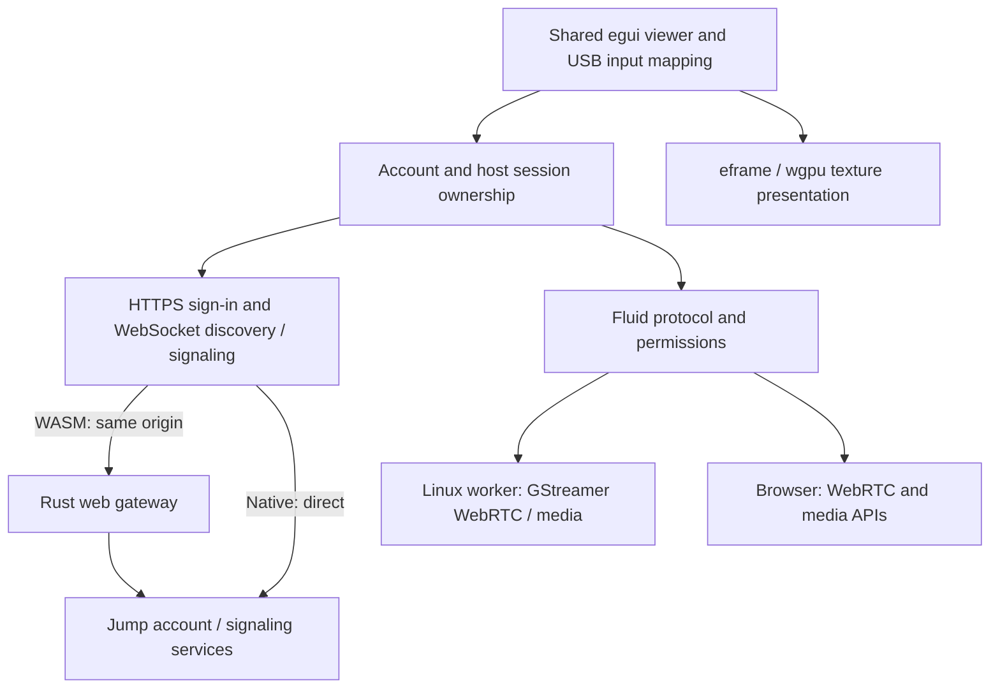

# Rust desktop client

An independent Rust viewer with one egui interface for native Linux and browser WebAssembly. The default viewer integrates account sign-in, computer discovery, Fluid host authentication, WebRTC media, and remote input. **Real Mac sessions on Linux and Chrome have verified password/MFA sign-in, discovery, host authentication, desktop video, pointer/Unicode keyboard input, audio playback, explicit clipboard transfer, view-only suppression, input release, and manual reconnect.** Browser network recovery also passes a live check. A separate synthetic desktop mode provides a repeatable local development fixture. This client does not implement RFB or host-side screen capture.

[Interoperability status](docs/jump-interoperability.md) records the real-host evidence, architecture, and remaining compatibility limits. This is experimental software, not a claim of feature parity with every vendor client or host version.

## Run on Linux

Use Rust 1.95 or newer, a C compiler/linker, pkg-config, GStreamer 1.28+ development libraries and runtime plugins, OpenSSL development files, Python 3, `patch`, and a working Wayland or X11 desktop with GPU drivers. See [the GStreamer prerequisites](rtc/README.md) and [the native media extension](native-media/README.md), which adds the AES-GCM SRTP profile observed on the real host. Dependencies are locked in `Cargo.lock`. Development was verified with Rust 1.98.1 on Linux; the minimum Rust version has not been separately tested.

From the repository root, start the independent client:

```bash
python3 client/native-media/build.py
bash client/scripts/run-native.sh
```

For codecs installed outside the system plugin directories, prefix the launcher with `GST_PLUGIN_PATH=/path/to/gstreamer-1.0`; it preserves that path alongside the DTLS extension. The live check on this checkout used `client/target/native-media/libav-runtime/usr/lib/gstreamer-1.0` for its process-local H.264 decoder. A fresh installation should supply the normal GStreamer codec packages described above.

Sign in with your Jump email/password and verification or recovery code when requested. Choose **Approve on computer** or **Computer username and password**, then select an online computer advertising Fluid RTC v2. The host must advertise support for the chosen method; unsupported methods fail before asking for credentials or sending an approval request. Host approval errors include the returned reason and code; rejection never triggers automatic credential fallback. Video appears only after the host grants viewing access. Passwords and account tokens remain in memory; account data is not persisted. On narrow windows, the computer list scrolls within a bounded panel so the session stays visible.

Click the remote image to capture input. Escape, leaving the image/window, losing focus, view-only mode, disconnect, and permission revocation release held input. Tab and arrow keys stay with the remote image while captured. The **Send keys** menu provides remote Escape, Caps Lock, and copy/cut/paste commands. Audio starts muted and can be enabled explicitly; a browser may require another playback gesture. Display selection uses advertised monitors. Refresh connection reconnects account signaling and requires selecting the computer again.

**Local text** mode sends committed Unicode text when the host advertises text down/up support. Mac hosts receive a down/up pair for one Unicode character and one completed event for longer strings. Windows uses the same distinction measured in UTF-16 units, so a single emoji also receives one completed event. The tested hosts ignore single-unit release-only events but insert whole strings on both edges. IME composition stays local until committed; the candidate window is positioned at the lower edge of the remote picture. Individual commits are bounded to 16 KiB, and IME replacements can delete up to 16 surrounding characters. **Physical keys** mode sends USB usages using the remote keyboard layout. Hosts that do not advertise text support use physical mode automatically. Physical and text events are separated to avoid duplicate characters, and pointer motion is coalesced without dropping button/key transitions.

With Clipboard enabled and host permission granted, the local paste shortcut sends UTF-8 content before issuing the host's paste shortcut. Copy/cut shortcuts affect the remote clipboard; use **Get remote clipboard** followed by **Copy text locally** to retrieve it. The explicit Send/Get/Copy text controls have a 1 MiB bound. The Send keys menu's remote paste uses the host's existing clipboard. Clipboard shortcuts use Command on a Fluid Mac peer and Control otherwise. Automatic bidirectional system clipboard synchronization is not implemented.

Network recovery uses delays of 1, 2, 4, 8, and 16 seconds, stopping after five attempts or two minutes. It uses the current account token and can restore only a previously authorized selected computer that remains advertised. Each replacement runs normal host authentication again; local host passwords, held input, and clipboard contents are not replayed. Cancel recovery, Disconnect, and Sign out cancel the pending intent. Authentication rejection, protocol errors, and explicit host termination stop recovery. Thirty seconds of stable service resets the retry budget. A live browser session recovered after the local gateway stopped and restarted, restored the selected computer, requested fresh host credentials, and resumed video. Native network-failure transitions have local integration coverage.

The host's RGBA cursor is drawn over the remote picture while hovering with control enabled. Hotspot, display scale, transparency, and explicit hidden state are preserved. Unknown shapes use the crosshair until their image arrives. The image cache holds at most 16 entries and 4 MiB; individual images are limited to 512×512. Delayed image replies cannot replace a newer selected shape. Viewing revocation and connection replacement clear the cursor. Remote cursor position tracking in view-only mode is not implemented.

Google, Apple, SSO, and browser challenges remain unfinished. A public preflight on September 13, 2026 returned no CORS allow-origin headers for the local web app, so browser account and signaling requests use our own Rust gateway on the app's origin. Live acceptance covers one personal Mac and an AWS Windows Server 2022 host running Jump Desktop Connect 10.15.23.0; the [evidence](docs/jump-interoperability.md) distinguishes each tested surface. TURN-only networks have not been validated. General Control/Command remapping, distinct left/right modifiers, numpad identity, physical lock-key synchronization, and operating-system/browser-reserved shortcuts remain limited by the current egui event adapter. Complex IME workflows and background suspension need broader platform testing.

For the local synthetic demo, start the server:

```bash
cargo run --locked --manifest-path client/Cargo.toml -p crabfleet-demo-server
```

In a second terminal, start the viewer:

```bash
cargo run --locked --manifest-path client/Cargo.toml -p crabfleet-viewer -- --demo
```

In demo mode, the crosshair follows the pointer, turns orange while a button is held, and the lower-left square lights up while a supported key is held. Text and wheel events are acknowledged but have no visible effect. This fixture uses its own protocol and cannot establish Jump sessions.

The server listens on `127.0.0.1:9001`, accepts at most four viewers, and gives each its own synthetic desktop. It cannot capture or control the host computer. Stop it with Ctrl+C.

## Run in a browser

Install the WASM target and matching local binding generator once:

```bash
rustup target add wasm32-unknown-unknown
cargo install wasm-bindgen-cli --version 0.2.128 --locked --root client/tools
```

Build and serve the standalone web app:

```bash
bash client/scripts/build-web.sh
cargo run --locked --manifest-path client/Cargo.toml -p crabfleet-web-gateway
```

Open [the local web viewer](http://127.0.0.1:8093/) for the sign-in interface, or [the demo viewer](http://127.0.0.1:8093/?demo=1) while the demo server is running. Both serve our own WASM application. The gateway supplies same-origin authentication and signaling; media remains on WebRTC. Use the exact address it prints. The demo requires port **8093** because its separate server allows only that browser origin. A browser with working WebGPU or WebGL2 and `requestVideoFrameCallback`/`cancelVideoFrameCallback` support is required. See [the gateway documentation](web-gateway/README.md) for bounds, trust, and deployment details. Public hosting requires your own HTTPS reverse proxy. No origin spoofing or browser security override is implemented.

The viewer exposes `window.crabfleet.diagnostics()` for local debugging: mode, connection state, frame count, input capture, and view-only state. Demo diagnostics also include acknowledgements. Account identifiers, tokens, SDP, passwords, and clipboard contents are omitted. `release_input()` releases capture and held input; `destroy()` closes the app and transport. Generated binaries and web assets are ignored by Git.

Blur and hiding the page release input directly from the browser event. The shared session continues polling through egui's background logic hook while the browser permits timers; fresh timestamps advance authentication and connection deadlines without a visible frame. Rendering resumes with the newest frame, and input queued before focus loss is discarded. A fully frozen or suspended browser may still require reconnection. Navigating away destroys the session, including startup still in progress; returning through the browser's back/forward cache reloads a signed-out viewer.

## Architecture



`viewer/` owns the shared egui UI, platform bridge, account/host runtime, GPU texture uploads, and input capture. `fluid/` implements observed Protocol Buffers, discovery, signaling routing, and host session state. [`rtc/`](rtc/README.md) provides GStreamer media/transport on Linux and browser WebRTC/media APIs on WASM. [`cloud/`](cloud/README.md) implements account sign-in, authenticated WebSocket signaling, discovery, and reconnect. [`web-gateway/`](web-gateway/README.md) serves the web assets and supplies the browser's same-origin account/signaling transport. `core/` has no third-party dependencies and owns the separate synthetic demo codec. `demo-server/` provides that test peer; it is a development tool, not a remote host agent. The viewer uses it only as a test dependency. `web/` supplies the minimal HTML/JavaScript loader.

The frame inbox retains only the newest decoded frame. The native runtime queue admits at most 128 commands and 4 MiB; overflow terminates the session so input releases cannot silently disappear. All GStreamer operations, including teardown, run off the UI thread. Browser audio activation stays within the UI gesture. Account/host switches fence stale commands and images; a separate media revision rejects input queued before an automatic replacement. Viewing revocation clears the texture even when permission returns in the same update. Both media adapters currently copy decoded RGBA into an egui GPU texture. Browser and codec internals have their own additional buffers. The synthetic demo separately times out after five seconds without frames.

We chose [egui/eframe](https://github.com/emilk/egui) to share the Rust UI between a native GPU window and WASM. Tauri is unnecessary for this implementation. Platform networking and media remain separate: WASM does not give browsers native TCP/UDP sockets or desktop codec APIs. Static inspection of Jump's public application shows a WebRTC path, so the native adapter uses GStreamer and the browser adapter uses browser WebRTC and media elements. Video currently passes through an RGBA copy for the shared UI; it is not a zero-copy renderer.

The demo protocol is explicitly separate from both [the existing Crabfleet RFB implementation](../src/app/rfb/) and Jump Fluid. See [the demo wire format](docs/demo-protocol.md). Normal account and host flows are integrated; the verified service checks and remaining desktop requirements are tracked separately in the interoperability notes.

## Verification

From the repository root:

Native workspace checks and viewer builds require GStreamer development libraries and runtime plugins listed in [the adapter documentation](rtc/README.md).

```bash
cargo fmt --all --manifest-path client/Cargo.toml -- --check
cargo test --locked --manifest-path client/Cargo.toml --workspace
node --test client/web/main.test.mjs
cargo clippy --locked --manifest-path client/Cargo.toml --workspace --all-targets -- -D warnings
cargo clippy --locked --manifest-path client/Cargo.toml --target wasm32-unknown-unknown -p crabfleet-viewer --lib -- -D warnings
cargo clippy --locked --manifest-path client/Cargo.toml --target wasm32-unknown-unknown -p crabfleet-rtc -p crabfleet-fluid -p crabfleet-cloud -- -D warnings
bash client/scripts/build-web.sh
bash client/scripts/test-browser-rtc.sh
```

Tests check malformed/truncated frames, negotiation, stale callbacks, pointer mapping, bounded frame replacement, the browser origin/subprotocol policy, and actual native WebSocket streaming with pointer/key/release acknowledgements and reconnection. Fluid tests cover authentication and permission transitions, strict wire bounds, redaction, and signaling routing. An egui logic-only test checks session polling and fresh time while the UI is hidden. Five Node tests exercise the real loader with synthetic page events and a fake renderer, including navigation during initialization; these are unit tests, not real-browser proof. The WebRTC test verifies actual encrypted control transport, VP8 and Opus decoding, and cleanup between two local peers. The native render proof launches the real GPU window, receives demo frames, saves only its own contents, and exits:

```bash
mkdir -p client/proof
cargo run --locked --manifest-path client/Cargo.toml -p crabfleet-viewer -- --screenshot client/proof/native.png
cargo run --locked --manifest-path client/Cargo.toml -p crabfleet-viewer -- --screenshot-login client/proof/sign-in.png
```

Native integration tests, native GPU rendering, WASM compilation, and real Chrome rendering of the signed-out interface and synthetic demo have passed. Chrome 153.0.8010.36 on Linux also verified demo pointer/key acknowledgements, Escape release, view-only suppression, immediate exported input release, socket teardown on navigation, and a fresh demo session after browser Back. The browser check exposed a system light-theme override; the shared viewer now explicitly keeps its dark theme so text and controls remain readable. Three WASM tests exercise the actual browser WebRTC adapter: fragmented control echo, media renegotiation, decoded video, received Opus samples, shutdown, and service-shaped STUN URI normalization. See [the interactive test instructions](rtc/README.md).

Live checks on September 14, 2026 verified normal Jump password/MFA sign-in, discovery, host credentials, desktop video, pointer/Unicode keyboard input, view-only suppression, Escape release, and explicit clipboard transfer on both targets. Text copied back from the host matched the synthetic test strings exactly, including accents, emoji, and combining characters. Per-application playback streams contained the remote TextEdit speech in both clients. Chrome exceeded 12,600 received frames before a gateway interruption and resumed video after automatic account/host selection recovery and fresh host credentials. AWS Windows Server 2022 also passed native-library acceptance and the Firefox 154 web interface: normal authentication, desktop video, Unicode typing and clipboard byte comparisons, view-only suppression, Escape release, and reconnect. That testing fixed Windows text duplication plus Firefox origin and live-frame handling. Edge 148 passes the browser adapter fixtures. The Windows VM has no audio endpoint, so its audible playback remains unverified. The native workspace passes 109 tests, with the separate Chromium integration test excluded from the default run. This directory is experimental and has not been published. The repository's existing TypeScript and macOS applications retain their separate build/test workflows.
